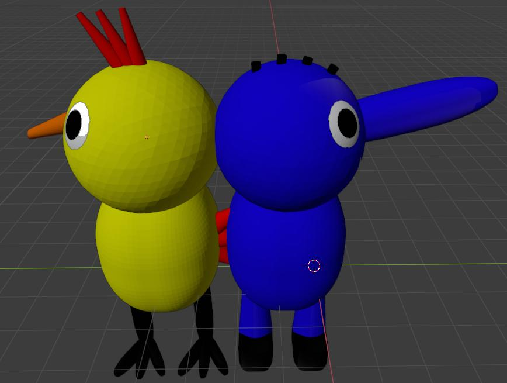
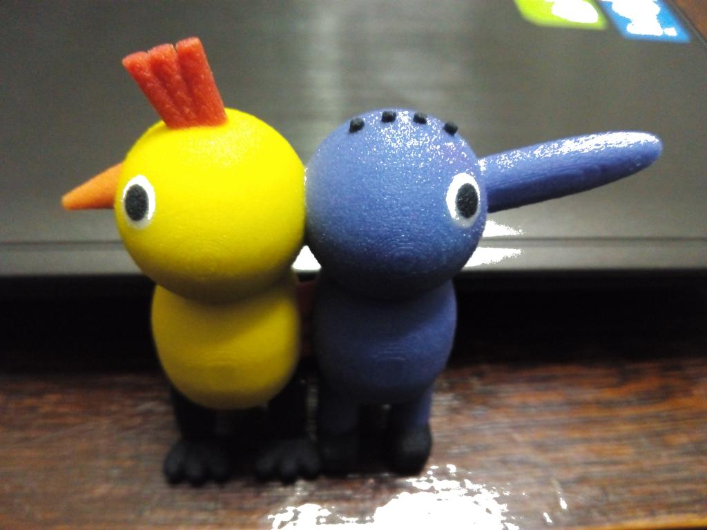
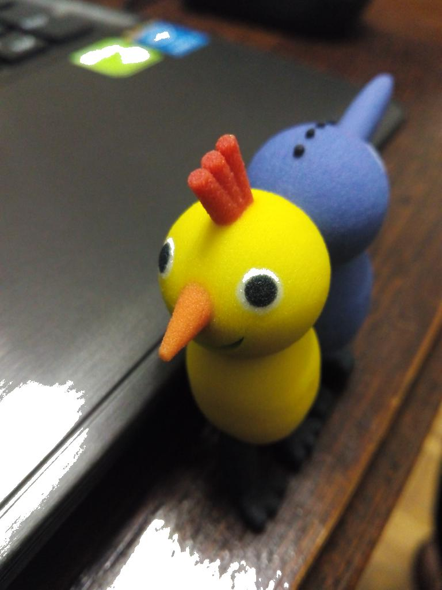
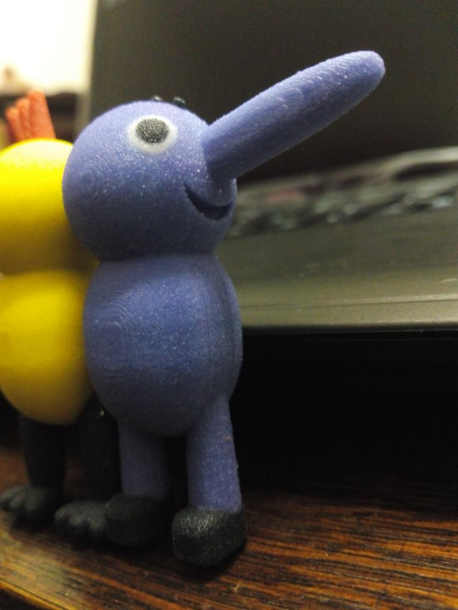

# gallifante

Este es un modelo de gallifante en 3D con colores hecho en Blender. Es un modelo francamente minimalista, nada que ver con las filigranas que han aparecido últimamente.

El modelo original es el archivo `gallifante.blend`. Hay también Una versión para impresión en formato X3D (el formato STL no permite guardar información de color, y el formato PLY en modo texto ocupa una barbaridad) en el archivo `gallifante.x3d`.

Imprimí una versión ligeramente distinta (con bocas de colores en vez de blancas, algunos detalles del gallo cambiados para hacerlo menos frágil, y con mallas mucho más detalladas, con mayor resolución) mediante el servicio "Full Color Sandstone" de Shapeways, en 2015. Dejé el modelo públicamente disponible, pero Shapeways parece que decidió eliminarlo hace algún tiempo. Acabo de intentar subirlo a Thingiverse, pero proceso de creación de cuentas no funciona correctamente. Así que lo subo a GitHub, que no me pone problemas :)

Creo que quedó razonablemente bonico:

